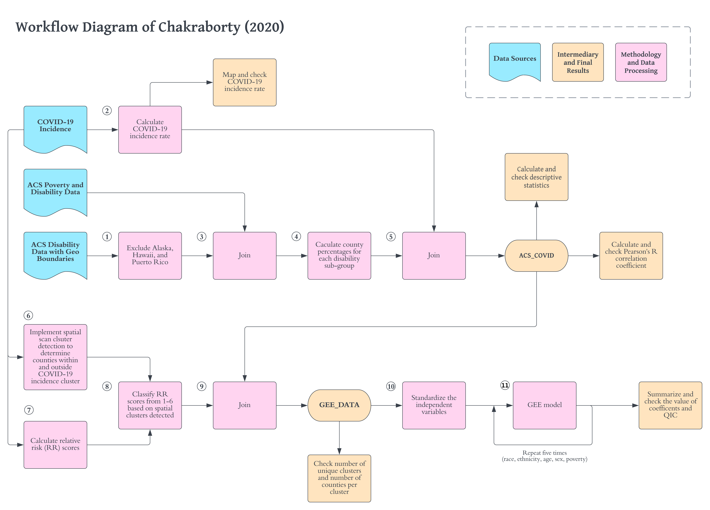

Version 2.0 \| First Created July 7, 2021 \| Updated June 26, 2023

# Abstract

Chakraborty (2021) investigates the relationships between COVID-19 rates and demographic characteristics of people with disabilities by county in the continental United States.
The aim of the study is to investigate whether people with disabilities (PwDs) face disproportionate challenges due to COVID-19.
To do so, Chakraborty examines the statistical relationship between county incidence rates of COVID-19 cases and county-level percentages of people with disabilities and different socio-demographic characteristics.
Specifically, Chakraborty tests county-level bivariate correlations between COVID-19 incidence against the percentage of disability as one hypothesis, and tests correlation between COVID-19 incidence and percentage of people with disabilities in 18 different socio-demographic categories of race, ethnicity, poverty status, age, and biological sex.
Chakraborty then re-tests for the same county-level associations while controlling for spatial dependence.
Spatial dependence is controlled by constructing generalized estimating equation (GEE) models using a combination of state and spatial clusters of COVID-19 incidence as to define the GEE clusters.
One GEE model is constructed for each of the four types of socio-demographic category: race, ethnicity, age, and biological sex.
Chakraborty (2021) finds significant positive relationships between COVID-19 rates and socially vulnerable demographic categories of race, ethnicity, poverty status, age, and biological sex.

This reproduction study is motivated by expanding the potential impact of Chakraborty's study for policy, research, and teaching purposes.
Measuring the relationship between COVID-19 incidence and socio-demographic and disability characteristics can provide important information for public health policy-making and resource allocation.
A fully reproducible study will increase the accessibility, transparency, and potential impact of Chakraborty's (2021) study by publishing a compendium complete with metadata, data, and code.
This will allow other researchers to review, extend, and modify the study and will allow students of geography and spatial epidemiology to learn from the study design and methods.

In this reproduction, we will attempt to identically reproduce all of the results from the original study.
This will include the map of county level distribution of COVID-19 incidence rates (Fig. 1), the summary statistics for disability and sociodemographic variables and bivariate correlations with county-level COVID-19 incidence rate (Table 1), and the GEE models for predicting COVID-19 county-level incidence rate (Table 2).
A successful reproduction should be able to generate identical results as published by Chakraborty (2021).

The reproduction study data and code are available in public a GitHub repository at [github.com/HEGSRR/RPr-Chakraborty2021](https://github.com/HEGSRR/RPr-Chakraborty2021) and the analysis plans and reports are registered with OSF at <https://doi.org/10.17605/OSF.IO/S5MTQ>.
The reproduction is implemented with R markdown using the `SpatialEpi` package for the Kulldorff spatial scan statistic packages and the `geepack` package for the generalized estimating equation.

Chakraborty, J.
2021.
Social inequities in the distribution of COVID-19: An intra-categorical analysis of people with disabilities in the U.S.
*Disability and Health Journal* 14:1-5.
<https://doi.org/10.1016/j.dhjo.2020.101007>

## Keywords

COVID-19; Disability; Intersectionality; Race/ethnicity; Poverty; Reproducibility

# Study design

The aim of this reproduction study is to implement the original study as closely as possible to reproduce the map of county level distribution of COVID-19 incidence rate, the summary statistics and bivariate correlation for disability characteristics and COVID-19 incidence, and the generalized estimating equations.
Our two confirmatory hypotheses are that we will be able to exactly reproduce Chakraborty's results as presented in table 1 and table 2.
Stated as null reproduction study hypotheses (RPr-H):

> RPr-H1: There is a less than perfect match between Chakraborty's bivariate correlation coefficient for each disability/sociodemographic variable and COVID-19 incidence rate and our bivariate correlation coefficient for each disability/sociodemographic variable and COVID-19 incidence rate.

> RPr-H2: There is a less than perfect match between Chakraborty's beta coefficient for the GEE of each disability/sociodemographic variable and our beta coefficient for the GEE of each disability/sociodemographic variable.

There are multiple models being tested within each of the two hypotheses.
That is, H1 and H2 both encompass five models, including one for each dimension of socio-demographics: race, ethnicity, poverty status, age, and biological sex.

# Original study design

The original study is **observational**, with the **exploratory** objective of determining "whether COVID-19 incidence is significantly greater in counties containing higher percentages of socio-demographically disadvantaged [people with disabilities], based on their race, ethnicity, poverty status, age, and biological sex" (Chakraborty 2021).

In the original study, 18 implicit bivariate hypotheses are tested for correlation between COVID-19 cumulative incidence rates and specific categories of PwDs at the county level.
Although the original publication does not state null hypotheses for each bivariate correlation, we may formulate the original research hypotheses (OR-H) as follows:

> OR-H1.1: There is no correlation between the COVID-19 incidence rate and the percentage of people with disabilities at the county level.
> OR-H1.2: There is no correlation between the COVID-19 incidence rate and the percentage of white people with disabilities at the county level.
> ... OR-H1.18 There is no correlation between the COVID-19 incidence rate and the percentage of female people with disabilities at the county level.

Five multi-variate hypotheses are tested for associations between COVID-19 cumulative incidence rates and subgroups of PwDs at the county level.
Although the original publication does not state null hypotheses for each model, we may formulate them as follows:

> OR-H2.1: The percentages of people with disability, categorized by race, are not associated with COVID-19 incidence at the county level when accounting for the state and risk level of COVID-19 clusters.
> ... OR-H2.5: The percentages of people with disability, categorized by gender, are not associated with COVID-19 incidence at the county level when accounting for the state and risk level of COVID-19 clusters.

The **spatial extent** of the study is the continental United States (48 contiguous states and Washington D.C.) The **spatial scale** of the analysis is at the county level.
Both COVID-19 incidence rates and demographic variables are all measured at the county level.
The **temporal extent** of the COVID-19 data ranges from 1/22/2020 (when John Hopkins began collecting the data) to 8/1/2020 (when the data was retrieved for the original study).
The data on disability and sociodemographic characteristics come from the U.S.
Census American Community Survey (ACS) five-year estimates for 2018 (2014-2018).

There is no **randomization** in the original study.



# Computational environment

The study was originally conducted using SaTScan software to implement the Kulldorff spatial scan statistic.
Other software are not specified in the publication; however data files suggest and communication with the author verifies that spatial analysis and mapping was conducted in ArcGIS, generalized estimating equation (GEE) models were calculated in SPSS, and the SaTScan software version was `9.6`.

This reproduction study uses R, including the SpatialEpi package for the Kulldorff spatial scan statistics and the geepack package for GEE models.


# Data

## ACS Socio-demographic data

The American Community Survey (ACS) five-year estimate (2014-2018) variables used in the study are outlined in the table below.
Details on ACS data collection can be found at <https://www.census.gov/topics/health/disability/guidance/data-collection-acs.html> and details on sampling methods and accuracy can be found at <https://www.census.gov/programs-surveys/acs/technical-documentation/code-lists.html>.

|                            Variable Name in Study                            |                                               ACS Variable name                                                |
|:----------------------------------:|:----------------------------------:|
| percent of total civilian non-institutionalized population with a disability |                                                 S1810_C03_001E                                                 |
|                                   **Race**                                   |                                                                                                                |
|                      percent w disability: White alone                       |                                                 S1810_C03_004E                                                 |
|                      percent w disability: Black alone                       |                                                 S1810_C03_005E                                                 |
|                    percent w disability: Native American                     |                                                 S1810_C03_006E                                                 |
|                      percent w disability: Asian alone                       |                                                 S1810_C03_007E                                                 |
|                       percent w disability: Other race                       |                                                 S1810_C03_009E                                                 |
|                                **Ethnicity**                                 |                                                                                                                |
|                   percent w disability: Non-Hispanic White                   |                                                S1810_C03_0011E                                                 |
|                        percent w disability: Hispanic                        |                                                 S1810_C03_012E                                                 |
|                 percent w disability: Non-Hispanic non-White                 | (S1810_C02_001E - S1810_C02_011E - S1810_C02_012E) / (S1810_C01_001E - S1810_C01_011E - S1810_C01_012E) \* 100 |
|                       percent w disability: Other race                       |                                                 S1810_C03_009E                                                 |
|                                 **Poverty**                                  |                                                                                                                |
|                  percent w disability: Below poverty level                   |                         (C18130_004E + C18130_011E + C18130_018E) / C18130_001E \* 100                         |
|                  percent w disability: Above poverty level                   |                         (C18130_005E + C18130_012E + C18130_019E) / C18130_001E \* 100                         |
|                                   **Age**                                    |                                                                                                                |
|                          percent w disability: 5-17                          |                                                 S1810_C03_014E                                                 |
|                         percent w disability: 18-34                          |                                                 S1810_C03_015E                                                 |
|                         percent w disability: 35-64                          |                                                 S1810_C03_016E                                                 |
|                         percent w disability: 65-74                          |                                                 S1810_C03_017E                                                 |
|                          percent w disability: 75+                           |                                                 S1810_C03_018E                                                 |
|                              **Biological sex**                              |                                                                                                                |
|                          percent w disability: male                          |                                                 S1810_C03_001E                                                 |
|                         percent w disability: female                         |                                                 S1810_C03_003E                                                 |

: Disability Subgroup Variables

American Community Survey (ACS) data for sociodemographic subcategories of people with disabilities can be accessed by using the `tidycensus` package to query the Census API. This requires an API key which can be acquired at [api.census.gov/data/key_signup.html](https://api.census.gov/data/key_signup.html).


### ACS data transformations

The original study extent is the lower 48 states and Washington D.C. Therefore, Alaska, Hawai'i and Puerto Rico are removed from the data (workflow step 1).
Data on people with disabilities in poverty is derived from a different census table (C18130) than data on people with disabilities and age, race, ethnicity, age, and biological sex (S1810).
Therefore, join the poverty data to the other data using the GEOID (workflow step 3).
Also transform the ACS geographic data into Contiguous USA Albers Equal Area projection and fix geometry errors.


Optionally, save the raw ACS data to `data/raw/public/acs.gpkg` for use in GIS software.


Calculate independent socio-demographic variables of people with disabilities as percentages for each sub-category of disability (race, ethnicity, poverty, age, and biological sex) and remove raw census data from the data frame (workflow step 4).
Reproject the data into an Albers equal area conic projection.


## COVID-19 data

Data on COVID-19 cases from the Johns Hopkins University dashboard have been provided directly with the research compendium because the data is no longer available online in the state in which it was downloaded on August 1, 2020.
The dashboard and cumulative counts of COVID-19 cases and deaths were continually updated, so an exact reproduction required communication with the original author, Jayajit Chakraborty, for assistance with provision of data from August 1, 2020.
The data includes an estimate of the total population (`POP_ESTIMA`) and confirmed COVID-19 cases (`Confirmed`).
The COVID-19 case data expresses cumulative count of reported COVID-19 from 1/22/2020 to 8/1/2020.
Although metadata for this particular resource is no longer available from the original source, one can reasonably assume that the total population estimate was based on the 2014-2018 5-year ACS estimate, as the 2019 estimates data had not been released yet.

Versions of the data can be found at the John Hopkins CCSE COVID-19 Data Repository (<https://github.com/CSSEGISandData/COVID-19>).
However, archived data only provides summaries at the national scale.
We received the COVID-19 case data through 8/1/2020 at the county level from the author, as there is no readily apparent way to access archived data from the Johns Hopkins University Center for Systems Science Engineering database.


### COVID-19 data transformations

Calculate the COVID incidence rate as the cases per 100,000 people (workflow step 2).
Convert the COVID data to a non-geographic data frame.


Join dependent COVID data to independent ACS demographic data.


## Missing data

**Unplanned deviation for reproduction**: There is one county with missing disability and poverty data.
This was not mentioned in the original study or in our pre-analyis plan.
However, we replace the missing data with zeros, producing results identical to Chakraborty's.


\begin{tabular}{l|l|l|l|r|r|r|r|r|r|r|r|r|r|r|r|r|r|r|r|r|r|r|r|r|r|r}
\hline
fips & statefp & county & county\_st & covid\_rate & dis\_pct & white\_pct & black\_pct & native\_pct & asian\_pct & other\_pct & non\_hisp\_white\_pct & hisp\_pct & non\_hisp\_non\_white\_pct & bpov\_pct & apov\_pct & pct\_5\_17 & pct\_18\_34 & pct\_35\_64 & pct\_65\_74 & pct\_75 & male\_pct & female\_pct & pop & cases & x & y\\
\hline
35039 & 35 & Rio Arriba & Rio Arriba County, New Mexico & 751.17 & 16.06467 & 10.77458 & 0.038371 & 2.744807 & 0.038371 & 2.468536 & 2.355981 & 11.39619 & 2.312494 & NA & NA & 0.3069682 & 1.258569 & 6.781439 & 3.391998 & 4.279648 & 8.556738 & 7.50793 & 39006 & 293 & -106.6932 & 36.50962\\
\hline
\end{tabular}

## Map COVID-19 incidence

Map the county level distribution of COVID-19 incidence rates, comparing to Figure 1 of the original study.

<!-- --> 

## Map disability rates

**Unplanned deviation for reproduction**: We also map the spatial distribution of the percent of people with any disability to improve our understanding of the geographic patterns and relationships of between the overarching independent variable (percentage of people with disability) and the dependent variable (COVID-19 incidence rate).

<!-- --> 

## Descriptive statistics

Calculate descriptive statistics for dependent COVID-19 rate and independent socio-demographic characteristics, reproducing the min, max, mean, and SD columns of original study table 1.

**Planned deviation for reanalysis**: We also calculate the Shapiro Wilk test for normality.

\begin{table}

\caption{\label{tab:descriptive-statistics}Reproduced Descriptive Statistics}
\centering
\begin{tabular}[t]{l|>{}c|>{}c|>{}c|>{}c|>{}c|>{}c}
\hline
  & min & max & mean & SD & ShapiroWilk & p\\
\hline
covid\_rate & 0.00 & 14257.17 & 966.90 & 1003.96 & 0.74 & 0\\
\hline
dis\_pct & 3.83 & 33.71 & 15.95 & 4.40 & 0.98 & 0\\
\hline
white\_pct & 0.85 & 33.26 & 13.55 & 4.63 & 0.98 & 0\\
\hline
black\_pct & 0.00 & 20.70 & 1.48 & 2.66 & 0.61 & 0\\
\hline
native\_pct & 0.00 & 13.74 & 0.28 & 0.94 & 0.28 & 0\\
\hline
asian\_pct & 0.00 & 3.45 & 0.09 & 0.18 & 0.51 & 0\\
\hline
other\_pct & 0.00 & 15.24 & 0.55 & 0.65 & 0.57 & 0\\
\hline
non\_hisp\_white\_pct & 0.10 & 33.16 & 12.84 & 4.81 & 0.99 & 0\\
\hline
hisp\_pct & 0.00 & 25.26 & 0.99 & 2.15 & 0.42 & 0\\
\hline
non\_hisp\_non\_white\_pct & 0.00 & 20.93 & 2.13 & 2.75 & 0.70 & 0\\
\hline
bpov\_pct & 0.00 & 14.97 & 3.57 & 1.85 & 0.93 & 0\\
\hline
apov\_pct & 0.00 & 27.30 & 12.48 & 3.06 & 0.99 & 0\\
\hline
pct\_5\_17 & 0.00 & 5.08 & 1.03 & 0.48 & 0.95 & 0\\
\hline
pct\_18\_34 & 0.00 & 5.59 & 1.56 & 0.67 & 0.96 & 0\\
\hline
pct\_35\_64 & 1.01 & 18.36 & 6.35 & 2.30 & 0.96 & 0\\
\hline
pct\_65\_74 & 0.00 & 12.73 & 3.09 & 1.16 & 0.95 & 0\\
\hline
pct\_75 & 0.00 & 11.13 & 3.87 & 1.19 & 0.97 & 0\\
\hline
male\_pct & 1.30 & 18.19 & 8.06 & 2.37 & 0.98 & 0\\
\hline
female\_pct & 1.91 & 19.94 & 7.90 & 2.26 & 0.98 & 0\\
\hline
\end{tabular}
\end{table}

Compare reproduced descriptive statistics to original descriptive statistics.
Difference is calculated as 'reproduction study - original study'.
Identical results will result in zero.

\begin{table}

\caption{\label{tab:compare-descriptive-stats}Descriptive Statistics Comparison}
\centering
\begin{tabular}[t]{l|>{\centering\arraybackslash}p{4em}|>{\centering\arraybackslash}p{4em}|>{\centering\arraybackslash}p{4em}|>{\centering\arraybackslash}p{4em}}
\hline
  & min & max & mean & SD\\
\hline
covid\_rate & 0 & 0.17 & -0.1 & -0.04\\
\hline
dis\_pct & 0 & 0.00 & 0.0 & 0.00\\
\hline
white\_pct & 0 & 0.00 & 0.0 & 0.00\\
\hline
black\_pct & 0 & 0.00 & 0.0 & 0.00\\
\hline
native\_pct & 0 & 0.00 & 0.0 & 0.00\\
\hline
asian\_pct & 0 & 0.00 & 0.0 & 0.00\\
\hline
other\_pct & 0 & 0.00 & 0.0 & 0.00\\
\hline
non\_hisp\_white\_pct & 0 & 0.00 & 0.0 & 0.00\\
\hline
hisp\_pct & 0 & 0.00 & 0.0 & 0.00\\
\hline
non\_hisp\_non\_white\_pct & 0 & 0.00 & 0.0 & 0.00\\
\hline
bpov\_pct & 0 & 0.00 & 0.0 & 0.00\\
\hline
apov\_pct & 0 & 0.00 & 0.0 & 0.00\\
\hline
pct\_5\_17 & 0 & 0.00 & 0.0 & 0.00\\
\hline
pct\_18\_34 & 0 & 0.00 & 0.0 & 0.00\\
\hline
pct\_35\_64 & 0 & 0.00 & 0.0 & 0.00\\
\hline
pct\_65\_74 & 0 & 0.00 & 0.0 & 0.00\\
\hline
pct\_75 & 0 & 0.00 & 0.0 & 0.00\\
\hline
male\_pct & 0 & 0.00 & 0.0 & 0.00\\
\hline
female\_pct & 0 & 0.00 & 0.0 & 0.00\\
\hline
\end{tabular}
\end{table}

The descriptive statistics are identical, except that the original study seems to have rounded the COVID-19 statistics to zero decimal places.

# Analytical methods

## Bivariate parametric correlation analysis

The county-level Pearson's rho correlation coefficient was used to test association between intra-categorical rates of disability and COVID-19 incidence rates.
As this was a parametric test, normality should be tested.
A separate hypothesis was formulated for disability in aggregate and for each sociodemographic disability characteristic.

Calculate Pearson's R Correlation Coefficient of each independent variable and the COVID-19 incidence rate, reproducing the Pearson's R column of original study Table 1.

\begin{table}

\caption{\label{tab:pearsons-correlation}Reproduced Pearson's R}
\centering
\begin{tabular}[t]{c|>{\centering\arraybackslash}p{4em}|>{\centering\arraybackslash}p{4em}|>{\centering\arraybackslash}p{4em}}
\hline
variable & r & t & p\\
\hline
dis\_pct & -0.060 & 3.350 & 0.000\\
\hline
white\_pct & -0.332 & 19.612 & 0.000\\
\hline
black\_pct & 0.460 & 28.847 & 0.000\\
\hline
native\_pct & 0.019 & 1.072 & 0.142\\
\hline
asian\_pct & 0.094 & 5.272 & 0.000\\
\hline
other\_pct & 0.026 & 1.460 & 0.072\\
\hline
non\_hisp\_white\_pct & -0.361 & 21.545 & 0.000\\
\hline
hisp\_pct & 0.119 & 6.686 & 0.000\\
\hline
non\_hisp\_non\_white\_pct & 0.442 & 27.429 & 0.000\\
\hline
bpov\_pct & 0.106 & 5.914 & 0.000\\
\hline
apov\_pct & -0.151 & 8.513 & 0.000\\
\hline
pct\_5\_17 & 0.084 & 4.688 & 0.000\\
\hline
pct\_18\_34 & 0.063 & 3.493 & 0.000\\
\hline
pct\_35\_64 & -0.008 & 0.460 & 0.323\\
\hline
pct\_65\_74 & -0.091 & 5.113 & 0.000\\
\hline
pct\_75 & -0.186 & 10.541 & 0.000\\
\hline
male\_pct & -0.134 & 7.519 & 0.000\\
\hline
female\_pct & 0.023 & 1.305 & 0.096\\
\hline
pop & 0.128 & 7.215 & 0.000\\
\hline
cases & 0.209 & 11.891 & 0.000\\
\hline
x & 0.099 & 5.540 & 0.000\\
\hline
y & -0.412 & 25.195 & 0.000\\
\hline
\end{tabular}
\end{table}

Compare the reproduced Pearson's *r* correlation coefficients to the original study's Pearson's *r* correlation coefficients.
Stars indicates the significance level with two stars for `p < 0.01` and one star for `p < 0.05`.
Correlation difference `rp_r_diff` is calculated between the reproduction study `rp_r` and original study `or_r` as `rp_r_diff = rp_r - or_r` Direction difference `rp_dir_diff` is calculated as `(rp_r > 0) - (or_r > 0)`, giving `0` if both coefficients have the same direction, `1` if the reproduction is positive and the original is negative, and `-1` if the reproduction is negative but the original is positive.

\begin{table}

\caption{\label{tab:compare-pearsons-correlation}Compare reproduced and original Pearson's R}
\centering
\begin{tabular}[t]{c|c|c|c|c|c|c|c}
\hline
\multicolumn{1}{c|}{ } & \multicolumn{2}{c|}{Original} & \multicolumn{2}{c|}{Reproduced} & \multicolumn{3}{c}{Difference} \\
\cline{2-3} \cline{4-5} \cline{6-8}
Variable & R & Sig. Level & R & Sig. Level & R & Sig. Level & Direction\\
\hline
dis\_pct & -0.056 & 2 & -0.060 & 2 & -0.004 & 0 & 0\\
\hline
white\_pct & -0.326 & 2 & -0.332 & 2 & -0.006 & 0 & 0\\
\hline
black\_pct & 0.456 & 2 & 0.460 & 2 & 0.004 & 0 & 0\\
\hline
native\_pct & 0.020 & 0 & 0.019 & 0 & -0.001 & 0 & 0\\
\hline
asian\_pct & 0.097 & 2 & 0.094 & 2 & -0.003 & 0 & 0\\
\hline
other\_pct & 0.028 & 0 & 0.026 & 0 & -0.002 & 0 & 0\\
\hline
non\_hisp\_white\_pct & -0.355 & 2 & -0.361 & 2 & -0.006 & 0 & 0\\
\hline
hisp\_pct & 0.119 & 2 & 0.119 & 2 & 0.000 & 0 & 0\\
\hline
non\_hisp\_non\_white\_pct & 0.439 & 2 & 0.442 & 2 & 0.003 & 0 & 0\\
\hline
bpov\_pct & 0.108 & 2 & 0.106 & 2 & -0.002 & 0 & 0\\
\hline
apov\_pct & -0.146 & 2 & -0.151 & 2 & -0.005 & 0 & 0\\
\hline
pct\_5\_17 & 0.083 & 2 & 0.084 & 2 & 0.001 & 0 & 0\\
\hline
pct\_18\_34 & 0.066 & 1 & 0.063 & 2 & -0.003 & 1 & 0\\
\hline
pct\_35\_64 & -0.005 & 0 & -0.008 & 0 & -0.003 & 0 & 0\\
\hline
pct\_65\_74 & -0.089 & 2 & -0.091 & 2 & -0.002 & 0 & 0\\
\hline
pct\_75 & -0.181 & 2 & -0.186 & 2 & -0.005 & 0 & 0\\
\hline
male\_pct & -0.131 & 2 & -0.134 & 2 & -0.003 & 0 & 0\\
\hline
female\_pct & 0.028 & 0 & 0.023 & 0 & -0.005 & 0 & 0\\
\hline
\end{tabular}
\end{table}

Reproduction correlation coefficients varied slightly from the original study coefficients by +/- 0.006.
All but one Pearson's correlation coefficient was significant to the same level, and the exception was age 18 to 34.
Counter-intuitively, the correlation coefficient was slightly closer to 0 but the *p* value was also found to be more significant, suggesting a difference in the estimation of *t* and/or *p*, or a typographical error.
All of the coefficients had the same direction.

**Unplanned Deviation for Reproduction**: We should expect identical results for this correlation test, so we loaded the original author's data from `Aug1GEEdata.csv` to re-test the statistic, calculated as `unplanned_r` below.

\begin{table}

\caption{\label{tab:original-data-pearson-correlation}Recalculation of Pearson's R with original data}
\centering
\begin{tabular}[t]{c|c|c|c}
\hline
variable & unplanned\_r & or\_r & diff\\
\hline
dis\_pct & -0.056 & -0.056 & 0\\
\hline
white\_pct & -0.326 & -0.326 & 0\\
\hline
black\_pct & 0.456 & 0.456 & 0\\
\hline
native\_pct & 0.020 & 0.020 & 0\\
\hline
asian\_pct & 0.097 & 0.097 & 0\\
\hline
other\_pct & 0.028 & 0.028 & 0\\
\hline
non\_hisp\_white\_pct & -0.355 & -0.355 & 0\\
\hline
hisp\_pct & 0.119 & 0.119 & 0\\
\hline
non\_hisp\_non\_white\_pct & 0.439 & 0.439 & 0\\
\hline
bpov\_pct & 0.108 & 0.108 & 0\\
\hline
apov\_pct & -0.146 & -0.146 & 0\\
\hline
pct\_5\_17 & 0.083 & 0.083 & 0\\
\hline
pct\_18\_34 & 0.066 & 0.066 & 0\\
\hline
pct\_35\_64 & -0.005 & -0.005 & 0\\
\hline
pct\_65\_74 & -0.089 & -0.089 & 0\\
\hline
pct\_75 & -0.181 & -0.181 & 0\\
\hline
male\_pct & -0.131 & -0.131 & 0\\
\hline
female\_pct & 0.028 & 0.028 & 0\\
\hline
\end{tabular}
\end{table}

The author's original data produced coefficients identical to the original publication!
Is it possible that the data values are correct but have been reassigned / transposed to different counties?

*Unplanned Deviation for Reproduction*: Considering the precise bitwise reproduction of descriptive statistics and of correlation statistics from author-provided data, we decided to recalculate the COVID-19 incidence rate with author-provided case and population data for comparison to the author-provided incidence rate.

\begin{table}

\caption{\label{tab:compare-incidence-rate}Counties with inconsistent COVID-19 incidence rate}
\centering
\resizebox{\linewidth}{!}{
\begin{tabular}[t]{r|l|l|r|r|r|r|r}
\hline
FIPS & State & County & Population & Cases & OR\_Incidence & RPr\_Incidence & Difference\\
\hline
1115 & Alabama & St. Clair & 88690 & 1151 & 1349.52 & 1297.78 & -51.74\\
\hline
1117 & Alabama & Shelby & 215707 & 2911 & 1297.78 & 1349.52 & 51.74\\
\hline
5123 & Arkansas & St. Francis & 25439 & 1112 & 704.16 & 4371.24 & 3667.08\\
\hline
5125 & Arkansas & Saline & 121421 & 855 & 397.33 & 704.16 & 306.83\\
\hline
5127 & Arkansas & Scott & 10319 & 41 & 314.15 & 397.33 & 83.18\\
\hline
5129 & Arkansas & Searcy & 7958 & 25 & 1322.08 & 314.15 & -1007.93\\
\hline
5131 & Arkansas & Sebastian & 127753 & 1689 & 5420.39 & 1322.08 & -4098.31\\
\hline
5133 & Arkansas & Sevier & 17139 & 929 & 570.08 & 5420.39 & 4850.31\\
\hline
5135 & Arkansas & Sharp & 17366 & 99 & 4371.24 & 570.08 & -3801.16\\
\hline
8039 & Colorado & Elbert & 26282 & 85 & 626.60 & 323.42 & -303.18\\
\hline
8041 & Colorado & El Paso & 713856 & 4473 & 323.42 & 626.60 & 303.18\\
\hline
8065 & Colorado & Lake & 7824 & 70 & 349.85 & 894.68 & 544.83\\
\hline
8067 & Colorado & La Plata & 56310 & 197 & 894.68 & 349.85 & -544.83\\
\hline
\end{tabular}}
\end{table}

We found that 13 counties had incorrect COVID-19 incidence scores, and the scores seem to be transposed from other counties, such that the overall descriptive statistics were accurate but the correlation coefficients were inaccurate.
This finding implies that subsequent analyses using the COVID-19 Incidence rate will be slightly different and more accurate in this reproduction study than in the original study.

**Unplanned deviation for reproduction:** Join the original author's Incidence data into our reproduction data frame so that we can later test for sensitivity to this error.
Then report any counties for which the reproduced COVID incidence rate differs from the original author's COVID incidence rate.

\begin{table}

\caption{\label{tab:join-incidence-rate}Original incidence rate joined to reproduction data}
\centering
\begin{tabular}[t]{l|r|r}
\hline
county\_st & covid\_rate & or\_incidence\\
\hline
St. Clair County, Alabama & 1297.78 & 1349.52\\
\hline
Shelby County, Alabama & 1349.52 & 1297.78\\
\hline
St. Francis County, Arkansas & 4371.24 & 704.16\\
\hline
Saline County, Arkansas & 704.16 & 397.33\\
\hline
Scott County, Arkansas & 397.33 & 314.15\\
\hline
Searcy County, Arkansas & 314.15 & 1322.08\\
\hline
Sebastian County, Arkansas & 1322.08 & 5420.39\\
\hline
Sevier County, Arkansas & 5420.39 & 570.08\\
\hline
Sharp County, Arkansas & 570.08 & 4371.24\\
\hline
Elbert County, Colorado & 323.42 & 626.60\\
\hline
El Paso County, Colorado & 626.60 & 323.42\\
\hline
Lake County, Colorado & 894.68 & 349.85\\
\hline
La Plata County, Colorado & 349.85 & 894.68\\
\hline
\end{tabular}
\end{table}

The join worked, highlighting the same 13 counties with inconsistent incidence rates.
This also confirms that our reproduced dependent variable is identical to the original dependent variable with the exception of these three counties.

## Bivariate nonparametric correlation analysis

**Unplanned Deviation for Reproduction**: The dependent and independent variables in this study do not have normal distributions, as shown in the Shapiro-Wilk test results above.
Therefore, we deviate from the original study to use the Spearman's Rho non-parametric correlation test.


Compare the Spearman's *rho* correlation coefficients to the reproduced Pearson's *r* correlation coefficients.
Differences are calculated as *Spearman's Rho* - *Pearson's R*.

\begin{table}
\centering
\begin{tabular}{c|c|c|c|c|c|c|c}
\hline
\multicolumn{1}{c|}{ } & \multicolumn{2}{c|}{Pearson's} & \multicolumn{2}{c|}{Spearman's} & \multicolumn{3}{c}{Difference} \\
\cline{2-3} \cline{4-5} \cline{6-8}
Variable & R & Stars & Rho & Stars & Rho - R & Stars & Direction\\
\hline
dis\_pct & -0.060 & 2 & -0.113 & 2 & -0.053 & 0 & 0\\
\hline
white\_pct & -0.332 & 2 & -0.421 & 2 & -0.089 & 0 & 0\\
\hline
black\_pct & 0.460 & 2 & 0.575 & 2 & 0.115 & 0 & 0\\
\hline
native\_pct & 0.019 & 0 & -0.084 & 2 & -0.103 & 2 & -1\\
\hline
asian\_pct & 0.094 & 2 & 0.194 & 2 & 0.100 & 0 & 0\\
\hline
other\_pct & 0.026 & 0 & 0.104 & 2 & 0.078 & 2 & 0\\
\hline
non\_hisp\_white\_pct & -0.361 & 2 & -0.454 & 2 & -0.093 & 0 & 0\\
\hline
hisp\_pct & 0.119 & 2 & 0.231 & 2 & 0.112 & 0 & 0\\
\hline
non\_hisp\_non\_white\_pct & 0.442 & 2 & 0.481 & 2 & 0.039 & 0 & 0\\
\hline
bpov\_pct & 0.106 & 2 & 0.062 & 2 & -0.044 & 0 & 0\\
\hline
apov\_pct & -0.151 & 2 & -0.205 & 2 & -0.054 & 0 & 0\\
\hline
pct\_5\_17 & 0.084 & 2 & 0.079 & 2 & -0.005 & 0 & 0\\
\hline
pct\_18\_34 & 0.063 & 2 & 0.034 & 1 & -0.029 & -1 & 0\\
\hline
pct\_35\_64 & -0.008 & 0 & -0.020 & 0 & -0.012 & 0 & 0\\
\hline
pct\_65\_74 & -0.091 & 2 & -0.151 & 2 & -0.060 & 0 & 0\\
\hline
pct\_75 & -0.186 & 2 & -0.285 & 2 & -0.099 & 0 & 0\\
\hline
male\_pct & -0.134 & 2 & -0.201 & 2 & -0.067 & 0 & 0\\
\hline
female\_pct & 0.023 & 0 & -0.014 & 0 & -0.037 & 0 & -1\\
\hline
\end{tabular}
\end{table}

Three variables change significance levels, with *Native American* and *Other* races gaining significance and *age 18-34* losing significance.
Two correlations change direction, with both *Native American* race (illustrated in scatterplot below) and *Female* households switching from positive correlations to negative correlations.
Instabilities between the parametric and non-parametic correlations arise from variables with very skewed distributions and/or weak correlations at the county level.
Some difference may also be attributable to the 13 counties with data errors in the COVID-19 Incidence Rate.
In such distributions, outlier observations have more weight in the parametric Person's R test than in the non-parametric Spearman's Rho test.

<!-- --> 

## Kulldorff spatial scan statistic

Although there were no major geographic *transformations* in this study, *geographic grouping criteria* for the generalized estimating equation (GEE) models are defined as a combination of states and COVID-19 risk, which is based on the Kulldorff spatial scan statistic for geographic clusters of high COVID-19 incidence.
The scan statistic in SaTScan used spherical great circle distance calculations based upon the latitude and longitude coordinates of the centroid of each county.
For this purpose, we have used the `X` and `Y` attributes provided as geographic variables with ACS data.

We use a Kulldorff spatial scan statistic to detect spatial clusters of high COVID-19 incidence (workflow step 6).
The statistic uses a Monte Carlo simulation to calculate statistical significance, and therefore may not produce identical results each time.

The original study uses SaTScan software to implement the Kulldorff spatial scan statistic model.
In SaTScan, models may be specified with many parameters having significant implications for results.
The original manuscript only specifies that Poisson model should be used.
We can also intuit that the model is discrete (locations are stationary and non-random), and spatial only (there is no temporal dimension).
The author-provided SaTScan results `SatScan_results.txt` contains additional parameters which appear to adhere closely to the software's default settings.
These include the maximum cluster size of "50 percent of population at risk", and the "GINI optimized cluster collection" and "no geographical overlap" options for detecting secondary clusters.
The "P-value Cutoff" for significant clusters option did not appear in the v9.6 output, suggesting that the software only allowed the default "no" option for this at the time of the original study.

SaTScan software can also output two versions of geographic data:

-   The `col` cluster polygon shapefile contains a circle for each cluster, where each polygon is a circle defined by the cluster center and radius. The attributes include a variable `REL_RISK` for cluster relative risk
-   The `gis` location point shapefile contains one point for each county in a cluster. The attributes include variables `LOC_RR` for local relative risk and `CLU_RR` for cluster relative risk

The SaTScan software implementation of the Kulldorff spatial scan statistic calculates two relative risk scores for locations:

-   Cluster relative risk is the incidence rate of the population within the cluster divided by the incidence rate of the population outside of the cluster. This is calculated as `REL_RISK` in the `col` cluster polygon shapefile and as `CLU_RR` in the `gis` location point shapefile.
-   Local relative risk is the incidence rate of population within a location divided by the incidence rate of the population outside of the location. This is calculated as `LOC_RR` in the `gis` location shapefile, and is not calculated in the `col` cluster polygon shapefile.

For the purposes of interpreting the spatial scan statistic, a *location* is a *county centroid* while a *cluster* is a *collection of counties* with high incidence rates, defined in the shape of a circle with a *center* location (a county centroid) and a *radius*.

The original study is not clear about using the cluster geographic data *vs* the location geographic data or the cluster relative risk *vs* local relative risk.
However, The author-provided `SatScan_results.txt` results file indicates a geographic cluster file but no location file, and the author-provided `Aug1GEEdata.csv` data table contains a `REL_RISK` field but no `CLU_RR` field or `LOC_RR` field.
This suggests that in the original study, the `col` polygon cluster shapefile and *cluster* relative risk were used to represent COVID-19 risk and define GEE clusters.

The spatial scan statistic is based on case counts and total population, and is therefore unaffected by errors in the COVID Incidence rate.

**Planned deviation for reproduction**: We opted to use the SpatialEpi package in R, selecting open source software with R integration over SatSCan software, which is free but not open.
The Kulldorff spatial scan statistic model in SpatialEpi also supports a discrete Poisson spatial model, and uses the GINI coefficient to select secondary clusters with no geographical overlap that maximize the difference between locations inside of clusters and locations outside of clusters.
We expected that this set of software options could reproduce identical results compared to SaTScan.

First, calculate the Kulldorff spatial scan statistic using SpatialEpi.
Optionally, skip this code block due to long run times of more than 10 minutes.


Load pre-calculated Kulldorff spatial scan results.
Alternatively, skip or modify this code block to use your own version of the SpatialEpi Kulldorff results.


Report Kulldorff spatial scan results.


```
## [1] Most likely cluster:
```

```
## $location.IDs.included
##  [1] 1824 1835 1797 1818 1825 1749 1854 1742 1837 1747 1838  280 1760 1846 1756
## 
## $population
## [1] 16949211
## 
## $number.of.cases
## [1] 469091
## 
## $expected.cases
## [1] 233805.6
## 
## $SMR
## [1] 2.006329
## 
## $log.likelihood.ratio
## [1] 97983.07
## 
## $monte.carlo.rank
## [1] 1
## 
## $p.value
## [1] 0.001
```

```
## [1] Number of Secondary clusters: 134
```

The `SpatialEpi` implementation of Kulldorff spatial scan statistics provides output in the form of hierarchical lists analogous to the text output of SaTScan, but does not output a simple data frame or tabular output analogous to the shapefiles from SaTScan.
Therefore, additional steps are required to append the Kulldorff scan results to the `acs_covid` simple features data frame.
This can be done by assigning unique cluster ID's to each county within a cluster.
Clusters include the county at the center of a cluster and all of the other counties within the cluster radius.
Therefore, we use the FIPS code of the county at the center of each cluster as the unique cluster ID.


### Map Kulldorff clusters

**Unplanned deviation for reproduction**: The original study does not include visualizations of the spatial structure and distribution of COVID-19 clusters.

First, we must join the Kulldorff spatial scan cluster IDs to the acs_covid simple features dataframe.
Although this was planned in workflow step 9, the order of operations between steps 9 and steps 7 and 8 is not important.

Next, calculate a new field `isCluster` to identify counties in COVID-19 clusters.
Additionally, distinguish between counties defining the center of a cluster from counties constituting other parts of a cluster by comparing the cluster ID (equivalent to the center county's fips code) to the county fips code.


**Planned deviation for reproduction**: Map the `SpatialEpi` cluster results.

<!-- --> 

**Unplanned deviation for reproduction**: The `SpatialEpi` implementation of Kulldorff spatial scan statistics does not calculate local relative risk or cluster relative risk.
Therefore, the next step is to calculate local and cluster relative risk (workflow step 7).


Classify relative risk on a scale from 1 to 6 (workflow step 8).
Risk is classified according to this table:

| Relative Risk Values | Relative Risk Class |
|:--------------------:|:-------------------:|
|  Outside of cluster  |          1          |
|       RR \< 1        |          1          |
|    1 \<= RR \< 2     |          2          |
|    2 \<= RR \< 3     |          3          |
|    3 \<= RR \< 4     |          4          |
|    4 \<= RR \< 5     |          5          |
|    5 \<= RR \< 6     |          6          |

Counties falling outside of any cluster are assigned a score of 1.


### Map relative risk scores

**Unplanned deviation for reproduction**: It would be helpful to visualize the spatial distributions of local relative risk classes and Kulldorff cluster relative risk classes in advance of using these classes to control for spatial heterogeneity in GEE models.

First, map the spatial distribution of local relative risk score classifications.

<!-- --> 

Next, map the cluster relative risk scores for comparison.
Note that following the original study classification methodology, counties outside of clusters are assigned the lowest risk class of `1`.

<!-- --> 

Comparing the cluster and local relative risk classifications for regions like the Southeast, it is apparent that some areas of high risk are represented with large clusters that have an averaging effect on the cluster-based relative risk score.
This effect is more pronounced for clusters with low compactness (e.g. the Southeast cluster stretched over the "black belt" region from Louisiana and Arkansas to Georgia) than clusters with higher compactness (e.g. New York City) because the circular shape of clusters includes more low-risk counties.

### Compare clusters

The original study did not directly report any results from the Kulldorff spatial scan statistic.
However, the Kulldorff cluster relative risk scores were combined with states to create clusters for GEE models, hereafter called "GEE clusters".
The original study reported `102` unique GEE clusters having a range of `1` to `245` counties in each cluster.

In order to compare results, we first create cluster IDs as combinations of the state ID and COVID relative risk class.
The first clustering ID (State) and second clustering score (COVID relative risk class) were combined to form IDs for each unique combination of state and relative risk class.
Then, we find the number of unique clusters and frequency counties per cluster in our reproduction study for comparison to the original study.


```
## 111 unique clusters based on spatialEpi CLUSTER relative risk
```

```
##    Min. 1st Qu.  Median    Mean 3rd Qu.    Max. 
##    1.00    2.00    7.00   27.56   50.50  159.00
```

We failed to reproduce the same configuration of GEE clusters as the original study, finding 9 more clusters than the original study and a much smaller maximum cluster of 159 counties compared to 245 counties.

### Reproduce Kulldorff spatial scan statistic in SaTScan

**Unplanned deviation for reproduction**: Upon failing to reproduce an identical number of GEE clusters using SpatialEpi in R, we reproduced the procedure in the free but not open SaTScan software, using the current software version 10.1.
The input data files (`case`, `Coordinates.geo`, and `Population.pop`), and output data files (`sat_scan_rpr.txt`, `sat_scan_rpr.col.shp`, and `sat_scan_rpr.gis.shp`) are found in the `data/derived/public/satscan` directory.
The `sat_scan_rpr.txt` file reports the model parameters used in addition to results.

Although it is not ideal to intercede with this unplanned deviation at this step, is the first step in the methodology following the Kulldorff spatial scan statistic with a result reported in the original publication.

First, load and verify whether our SaTScan reproduction data compares to the author-provided SaTScan data.


```
## 96 reproduced relative risk observations
## 96 author-provided relative risk observations
```

```
## 96 reproduced relative risk values match the original author's relative risk values
```

Our SaTScan results exactly reproduced the author-provided SaTScan results data.

#### Map SaTScan spatial clusters

Join the SaTScan results to `acs_covid` for mapping and analysis.


```
## Joining 96 records with 96 unique LOC_ID county values
```

**Unplanned deviation for reproduction**: Visualize the spatial distribution of the author-provided Kulldorff COVID-19 Clusters.

<!-- --> 

In the map above, clusters containing only one county have no visible circle.
Clusters containing two counties are encircled, but have no label.
Clusters containing three or more counties are encircled and labelled with the number of counties.

Note that this version of data only includes the 96 counties defining cluster centers, visualized with fill colors above.
The data excludes all of the non-center counties in clusters with more than one county.
The extent of these larger clusters is visualized by unfilled circles defined by cluster radii.

Additionally, the SaTScan software confusingly merges two sets of clusters in the results when the user uses the (default) option for GINI-optimized clusters.
One set of results is a hierarchical non-overlapping set of clusters.
These clusters are noted with `GINI_CLUST = F` in the results.
The second set of results is a set of hierarchical non-overlapping clusters designed to maximize the GINI coefficient of inequality between counties within clusters and counties outside of clusters.
These clusters are noted with `GINI_CLUST = T` in the results.

Merged together as they are, the two sets of secondary clusters overlap one another geographically, causing ambiguity in terms of which cluster-based relative risk score should be used at each location.

**Unplanned deviation for reproduction**: Can we also use these reproduced SaTScan results to exactly reproduce the author-reported frequency of original GEE classes and maximum counties per class?
If the results match, it will confirm that the problems identified above have propagated through the original study analysis.


```
## 102 unique clusters based on spatialEpi CLUSTER relative risk
```

```
##    Min. 1st Qu.  Median    Mean 3rd Qu.    Max. 
##    1.00    1.00    3.00   29.99   58.75  245.00
```

Using SaTScan Kulldorff clusters, we have exactly reproduced the author-reported frequency of original GEE classes and maximum counties per class.
We have confirmed that the original study used the *cluster relative risk* of the *center county* of each cluster, including both the *hierarchical* and *GINI-optimized* sets of clusters.

#### Compare SaTScan clusters to SpatialEpi clusters

**Unplanned Deviation for Reanalysis:** At this point it is clear that the best decision will be to shift from a *reproduction* study to a *reanalysis* study, intentionally altering methodological decisions to achieve a more valid outcome.
We prefer to include *all counties* contained in each cluster, and to use only *one set of non-overlapping clusters*, as produced by the `SpatialEpi` algorithm.

Given the shifting goal, how sensitive is this study to the choice of computational environment for the Kulldorff scan statistics?
To answer this question, we must load the local SaTSCan results inclusive of all counties within clusters, filter the results to focus on the standard hierarchical set of clusters, and compare the spatial distributions of the SaTScan and SpatialEpi results.


```
## SaTScan combined GIS output has 1306 records with 922 unique county values
```

```
## SaTScan Hierarchical clusters include 605 records with 605 unique county values
```

```
## SaTScan GINI-optimized clusters include 701 records with 701 unique county values
```

It was necessary to divide the Hierarchical clusters from the GINI clusters to avoid duplicates and geographic overlap.

Compare the SaTScan Hierarchical clusters to the SpatialEpi clusters.

<!-- --> 

The two methods only agree on the definition of the largest clusters in distant regions.
Thereafter, SpatialEpi detects many secondary clusters in the vicinity of the largest ones, while SaTScan detects seven isolated and low-probability counties.

Compare the SaTScan GINI Optimized clusters to the SpatialEpi clusters.

<!-- --> 

There is more agreement overall between SpatialEpi and SaTScan GINI Optimized clusters.
The two algorithms agree the most for smaller and less significant clusters above the 95% confidence threshold.
Because the SaTScan clusters are more limited in size, SaTScan detects several smaller clusters with gaps in place of the largest SpatialEpi clusters.

Keeping in mind that the final analysis uses a classification of cluster relative risk for GEE models, are there important differences between the two results with regard to classification of risk?
We can check by calculating cluster relative risk classes based on the SaTScan GINI clusters, and cross-tabulating with the SpatialEpi risk classes.

\begin{table}

\caption{\label{tab:compare-spatialepi-satscan}COVID-19 Risk Class by County}
\centering
\begin{tabular}[t]{>{}l|>{\centering\arraybackslash}p{3em}|>{\centering\arraybackslash}p{3em}|>{\centering\arraybackslash}p{3em}|>{\centering\arraybackslash}p{3em}|>{\centering\arraybackslash}p{3em}|>{\centering\arraybackslash}p{3em}}
\hline
\multicolumn{1}{c|}{SpatialEpi} & \multicolumn{6}{c}{SatScan} \\
\cline{1-1} \cline{2-7}
  & 1 & 2 & 3 & 4 & 5 & 6\\
\hline
\textbf{1} & 2092 & 78 & 0 & 0 & 0 & 0\\
\hline
\textbf{\textbf{2}} & \textbf{306} & \textbf{528} & \textbf{9} & \textbf{0} & \textbf{0} & \textbf{0}\\
\hline
\textbf{3} & 7 & 6 & 69 & 1 & 0 & 0\\
\hline
\textbf{4} & 1 & 3 & 0 & 5 & 0 & 0\\
\hline
\textbf{5} & 1 & 0 & 0 & 0 & 1 & 0\\
\hline
\textbf{6} & 0 & 0 & 0 & 0 & 0 & 1\\
\hline
\end{tabular}
\end{table}

Indeed, SpatialEpi has identified more than 300 counties with above normal risk that were not identified by SaTScan.
Meanwhile, SaTScan identified 78 counties with above normal risk that were not identified by SpatialEpi.

The maps and crosstabulation above indicate that there are important differences between the SaTScan and SpatialEpi computational environments for calculating secondary clusters.

We summarize our understanding of the computational differences for default settings below, based on close examination of our software outputs, technical documentation for SaTScan, and the documentation and code repository for SpatialEpi.

|                          |      SaTScan Hierarchical      |            SaTScan GINI            |                  SpatialEpi                  |
|:----------------:|:----------------:|:----------------:|:----------------:|
|     possible shapes      |  circle (default) or ellipse   |    circle (default) or ellipse     |                    circle                    |
| possible cluster centers | locations with rates \> normal |   locations with rates \> normal   |                all locations                 |
|   maximum cluster size   |          50% of cases          | varies, not exceeding 50% of cases |              50% of population               |
|  maximum *p* of cluster  |              1.00              |                1.00                |                     0.05                     |
|         distance         |     spherical great circle     |       spherical great circle       | spherical equidistant cylindrical projection |

To further interrogate the differences in sets of secondary clusters, we must understand that theoretically each location (county), may be the center of many different circular clusters defined by different radii, starting with a radius of 0 and the one county at the center, and expanding until the maximum cluster size is reached.

**SaTScan Hierarchical Clusters**

-   Select locations (counties) with above-normal COVID incidence rates
-   For each location, find log-likelihood of all possible cluster sizes (from minimum of 2 cases to maximum of 50% of cases) with *p* \< 1
-   For each location, select the cluster with the maximum log-likelihood, resulting in one possible cluster for each location with above-normal COVID incidence rates
-   Sort the remaining clusters by log-likelihood from greatest to least
-   Select the most likely cluster
-   Select secondary clusters by iterating over the remaining clusters, adding new clusters to the set of secondary clusters if they do not geographically overlap any of the clusters already identified as most likely or secondary (pg 68).

**SaTScan GINI-Optimized Clusters**

-   Follow the same procedure as SaTScan Hierarchical clusters, but iterate the procedure with different maximum cluster sizes. By default the cluster sizes include 1, 2, 3, 4, 5, 6, 8, 10, 12, 15, 20, 25, 30, 35, 40, 45, and 50 percent of cases. With the default setting, the result is 17 different sets of clusters.
-   For each set of clusters, calculate the GINI coefficient of the COVID-19 incidence inside the clusters vs outside the clusters.
-   Select the set of clusters with the highest GINI coefficient (i.e. the most difference between COVID-19 incidence inside the clusters vs outside the clusters).

**SpatialEpi Clusters**

-   For all locations, calculate the log likelihood of all the possible clusters below the maximum cluster size (50% of population)
-   Select the clusters with *p* \< 0.05
-   Sort the remaining clusters by log-likelihood from greatest to least (line 186)
-   Select the most likely cluster
-   Select secondary clusters by iterating over the remaining clusters, adding new clusters to the set of secondary clusters if they do not geographically overlap any of the clusters already identified as most likely or secondary (line 199).

The differences between these three approaches have very significant impacts on the results (see the differences in results in the **two maps** above) and it is impossible to control for all of the differences with the available parameters.
Most fundamentally, SaTScan develops sets of secondary clusters from a universe of just one most likely cluster per location with no default limitation its statistical significance, whereas SpatialEpi may consider multiple possible cluster sizes for each location with a default limitation of maximum 0.05 *p* for each cluster.
These fundamental differences are evident in the spatial distribution of clusters.
For example, New York City is the most likely cluster in all analyses.
For counties near New York, the radius of the most likely cluster is large and geographically overlaps New York City.
Therefore, if only the most significant cluster radius is considered as a possible secondary cluster for counties near New York City, all such clusters are disqualified by their geographical overlap.
This is what happens in the SaTScan Hierarchical Clusters model, for which the next nearest clusters are in Ohio and Virginia.
In the SaTScan GINI-optimized model, the maximum cluster size is apparently smaller, such that the most likely cluster in New York City is also smaller.
This change allows for two other non-overlapping secondary clusters in Rhode Island and New Jersey.
In contrast, the SpatialEpi algorithm still considers a variety of possible cluster sizes for each county, allowing for detection of smaller clusters adjacent to more significant ones.

Of course, the *relative risk* score of each cluster is contingent on the cluster size, so each difference in geographic configuration of clusters also impacts the cluster risk classification of individual locations.
The most stable results are for the most likely clusters in distinct regions (New York City, Southeast U.S., Southern California & Nevada), while the most variability appears for secondary clusters close enough for their most likely radius to overlap the more likely clusters.
The circular shape could be considered a major limitation of Kulldorff cluster detection, for which the SaTScan methodology enhances the limitation by constraining the possibility of nearby clusters while the SpatialEpi methodology can detect smaller adjacent secondary clusters.

The high significance threshold in the default SaTScan analysis allows the inclusion of many small clusters with low likelihoods, adding noise to the results.
This could be controlled by overriding the maximum *p* value parameter.
Combining all of the default parameters, SaTSCan includes small clusters of relatively low-risk counties in the Midwest, but excludes relatively high-risk counties adjacent to the major clusters of New York, the Southeast, and Southern California/Nevada.
This problem does not exist in the SpatialEpi implementation, and the SpatialEpi parameter *alpha level* parameter cannot be practically increased to `1` to match the SatSCan default.
This is because SpatialEpi does not filter counties by those with local relative risk greater than 1---therefore an *alpha value* of `1` results in *all* counties being included as clusters.

In sum, there are three construct validity issues with the original study's COVID-19 high-risk clusters as implemented in SaTScan.

1.  Two sets of overlapping secondary clusters are included in the SaTScan output: hierarchical clusters and clusters optimized by GINI coefficient.
2.  Only the 96 counties at the center of a cluster are considered in the risk classification.
3.  The geographic patterns and cluster relative risk scores of secondary clusters are limited to circles or ellipses and are apparently sensitive to both the geographic shape and situation of high-risk clusters and to subjective decisions in parameters and algorithms.

## Preprocess data for GEE modelling

**Unplanned deviation for reanalysis**: Based on the three observations above, we think that it would be more valid to choose one set of secondary clusters based on a single method rather than combining a set of hierarchical clusters with a set of GINI optimized clusters.
We also think that it would be more valid to include risk levels for all counties within a cluster (i.e. all counties within any of the circles above), rather than only the county at the center of a cluster.
Finally, we think it would be more valid to treat clusters as a single category rather than five tiers of above-normal risk.

To complete the reproduction/reanalysis study, we will therefore calculate and compare multiple versions of the GEE models:

1.  Original study results
2.  Original study data in geepack
3.  SpatialEpi cluster classification in geepack
4.  SpatialEpi binary clusters in geepack

### Unique GEE cluster IDs

First, calculate GEE cluster IDs.

We have already calculated: - `rp_clusID` based on our SpatialEpi clusters - `ss_clusID` based on our SaTScan cluster centers, and shown to be identical to the original author's data - `gini_clusID` based on our SaTScan GINI-optimized clusters

### Filter and standardize data

Second, filter the data for non-zero COVID-19 rates and z-score standardize the independent variables.
This accomplishes step 10 of the workflow diagram.

**Unplanned deviation for reproduction:** We assumed that we should filter for COVID rates \> 0 first and then calculate z-scores, however after comparing data in the next code block, we realized that the original study had *first* calculated z-scores and *then* filtered for COVID rates \> 0.
Therefore, to align with the original study, in the next code block we first calculate z-scores and then filter for COVID rates \> 0.


Compare independent variables for GEE models by subtracting the original values from the reproduced values, and finding the average and standard deviation of difference for each variable.


```
## Summary of difference between reproduction independent variables and original independent variables
```

```
## Mean:
```

```
##              z_white_pct              z_black_pct             z_native_pct 
##                        0                        0                        0 
##              z_asian_pct              z_other_pct     z_non_hisp_white_pct 
##                        0                        0                        0 
##               z_hisp_pct z_non_hisp_non_white_pct               z_bpov_pct 
##                        0                        0                        0 
##               z_apov_pct               z_pct_5_17              z_pct_18_34 
##                        0                        0                        0 
##              z_pct_35_64              z_pct_65_74                 z_pct_75 
##                        0                        0                        0 
##               z_male_pct             z_female_pct 
##                        0                        0
```

```
## 
## Standard deviation:
```

```
##              z_white_pct              z_black_pct             z_native_pct 
##                    0.000                    0.000                    0.000 
##              z_asian_pct              z_other_pct     z_non_hisp_white_pct 
##                    0.001                    0.001                    0.000 
##               z_hisp_pct z_non_hisp_non_white_pct               z_bpov_pct 
##                    0.000                    0.000                    0.000 
##               z_apov_pct               z_pct_5_17              z_pct_18_34 
##                    0.000                    0.001                    0.001 
##              z_pct_35_64              z_pct_65_74                 z_pct_75 
##                    0.000                    0.000                    0.000 
##               z_male_pct             z_female_pct 
##                    0.000                    0.000
```

When we had filtered for COVID rates \> 0 first and then z-score standardized second, the means of differences ranged from -0.012 to 0.004, and standard deviations of differences ranged from 0.000 to 0.016.

After changing the order to first z-score standardize and then filter for COVID rates \> 0, we observed no mean difference between our reproduced variables and the original variables, and we find no standard deviation \> 0.001 for the difference between reproduction independent variables and original variables.
There are no major differences between the independent variables.

#### Save final derived data

Optionally, you may save the preprocessed data to `data/raw/public/gee_data.gpkg`


Optionally, you may load the preprocessed data from `data/raw/public/gee_data.gpkg`


## GEE models

The generalized estimating equation (GEE) models were used to test association between intra-categorical rates of disability and COVID-19 incidence rates while accounting for spatial clustering.
A separate hypothesis was formulated for each type of subcategorization of PwDs, numbered H2.1 through H2.5 in Table 4.

As specified by the author, "GEEs extend the generalized linear model to accommodate clustered data, in addition to relaxing several assumptions of traditional regression (i.e., normality)".
Additionally, the author noted that "clusters of observations must be defined based on the assumption that observations within a cluster are correlated while observations from different clusters are independent." All five GEE models were specified with exchangeable correlation matrices, gamma distributions, and logarithmic link function.
These specifications were chosen after testing each alternative and choosing the models with the best quasilikelihood under the independence model criterion (QIC).

This accomplishes the step 11 of the workflow diagram.

Generalized Estimating Equation parameters:

"The **'exchangeable' correlation matrix** was selected for the results reported here, since this specification yielded the best statistical fit based on the QIC (quasi- likelihood under the independence) model criterion." (Chakraborty 2021, Methods paragraph 5)

"The **gamma distribution** with **logarithmic link function** was chosen for all GEEs since this model specification provided the lowest QIC value." (Chakraborty 2021, Methods paragraph 5)

### Original Table 2

Load digitized version of Table 2 from the original publication.

\begin{table}

\caption{\label{tab:load-table2}Original Publication Table 2}
\centering
\begin{tabular}[t]{c|c|c|c|c|c|c}
\hline
term & estimate & std.error & conf.low & conf.high & wald\_chi\_square & p\_stars\\
\hline
Race model intercept & 7.106 & 0.083 & 6.997 & 7.322 & 7465.214 & 2\\
\hline
White & -0.203 & 0.020 & -0.242 & -0.164 & 102.958 & 2\\
\hline
Black & 0.111 & 0.016 & 0.079 & 0.143 & 46.214 & 2\\
\hline
Native American & 0.051 & 0.009 & 0.033 & 0.069 & 31.438 & 2\\
\hline
Asian & 0.080 & 0.018 & 0.046 & 0.115 & 21.060 & 2\\
\hline
Other race & 0.077 & 0.017 & 0.044 & 0.115 & 21.030 & 2\\
\hline
Ethnicity model intercept & 7.186 & 0.083 & 7.023 & 7.348 & 7525.648 & 2\\
\hline
Non-Hispanic White & -0.237 & 0.022 & -0.280 & -0.194 & 116.954 & 2\\
\hline
Hispanic & 0.119 & 0.031 & 0.058 & 0.180 & 14.708 & 2\\
\hline
Non-Hispanic non-White & 0.118 & 0.016 & 0.086 & 0.149 & 53.248 & 2\\
\hline
Poverty model intercept & 7.183 & 0.072 & 7.043 & 7.324 & 10066.930 & 2\\
\hline
Below poverty level & 0.148 & 0.022 & 0.105 & 0.190 & 46.913 & 2\\
\hline
Above poverty level & -0.267 & 0.023 & -0.312 & -0.222 & 134.297 & 2\\
\hline
Age model intercept & 7.242 & 0.076 & 7.093 & 7.391 & 9093.179 & 2\\
\hline
Age 5-17 & 0.047 & 0.016 & 0.016 & 0.078 & 8.732 & 2\\
\hline
Age 18-34 & 0.038 & 0.022 & -0.005 & 0.081 & 3.008 & 0\\
\hline
Age 35-64 & -0.026 & 0.023 & -0.071 & 0.019 & 1.300 & 0\\
\hline
Age 65-74 & -0.089 & 0.021 & -0.131 & -0.047 & 17.597 & 2\\
\hline
Age 75 or more & -0.108 & 0.020 & -0.148 & -0.069 & 29.479 & 2\\
\hline
Biological sex model intercept & 7.223 & 0.072 & 7.081 & 7.365 & 9963.672 & 2\\
\hline
Male & -0.298 & 0.028 & -0.353 & -0.243 & 113.460 & 2\\
\hline
Female & 0.153 & 0.029 & 0.097 & 0.209 & 28.577 & 2\\
\hline
\end{tabular}
\end{table}

### GEE Function

Define a function for calculating and summarizing five GEE models


### Original Clusters and Original COVID-19 Rate

Calculate GEE models with: - Clustering: SaTScan cluster centers & State ID - Dependent variable: original COVID-19 incidence (including errors).

\begin{table}

\caption{\label{tab:gee-original-clusters-original-incidence}Original Cluster IDs and Original COVID-19 Incidence}
\centering
\begin{tabular}[t]{c|c|c|c|c|c|c}
\hline
term & estimate & std.error & conf.low & conf.high & stars & p.value\\
\hline
Race model intercept & 6.757 & 0.020 & 6.718 & 6.796 & 2 & 0.000\\
\hline
White & -0.201 & 0.026 & -0.251 & -0.150 & 2 & 0.000\\
\hline
Black & 0.281 & 0.020 & 0.242 & 0.321 & 2 & 0.000\\
\hline
Native American & 0.019 & 0.023 & -0.025 & 0.064 & 0 & 0.402\\
\hline
Asian & 0.064 & 0.024 & 0.016 & 0.112 & 2 & 0.008\\
\hline
Other race & 0.112 & 0.019 & 0.076 & 0.149 & 2 & 0.000\\
\hline
Ethnicity model intercept & 6.742 & 0.020 & 6.704 & 6.780 & 2 & 0.000\\
\hline
Non-Hispanic White & -0.226 & 0.026 & -0.277 & -0.175 & 2 & 0.000\\
\hline
Hispanic & 0.137 & 0.017 & 0.105 & 0.170 & 2 & 0.000\\
\hline
Non-Hispanic non-White & 0.278 & 0.019 & 0.241 & 0.315 & 2 & 0.000\\
\hline
Poverty model intercept & 6.816 & 0.021 & 6.774 & 6.858 & 2 & 0.000\\
\hline
Below poverty level & 0.240 & 0.027 & 0.186 & 0.293 & 2 & 0.000\\
\hline
Above poverty level & -0.303 & 0.030 & -0.362 & -0.245 & 2 & 0.000\\
\hline
Age model intercept & 6.820 & 0.021 & 6.779 & 6.862 & 2 & 0.000\\
\hline
Age 5-17 & 0.069 & 0.028 & 0.015 & 0.123 & 1 & 0.013\\
\hline
Age 18-34 & 0.029 & 0.034 & -0.038 & 0.097 & 0 & 0.395\\
\hline
Age 35-64 & 0.015 & 0.043 & -0.069 & 0.099 & 0 & 0.722\\
\hline
Age 65-74 & -0.044 & 0.042 & -0.126 & 0.039 & 0 & 0.298\\
\hline
Age 75 or more & -0.169 & 0.029 & -0.227 & -0.112 & 2 & 0.000\\
\hline
Biological sex model intercept & 6.814 & 0.021 & 6.772 & 6.855 & 2 & 0.000\\
\hline
Male & -0.402 & 0.042 & -0.484 & -0.319 & 2 & 0.000\\
\hline
Female & 0.298 & 0.044 & 0.212 & 0.385 & 2 & 0.000\\
\hline
\end{tabular}
\end{table}

### Original Clusters and Corrected COVID-19 Rate

Calculate GEE models with: - Clustering: SaTScan cluster centers & State ID - Dependent variable: reproduced COVID-19 incidence (corrected errors).

\begin{table}

\caption{\label{tab:gee-original-clusters-reproduced-incidence}Original Cluster IDs and Reproduced COVID-19 Incidence}
\centering
\begin{tabular}[t]{c|c|c|c|c|c|c}
\hline
term & estimate & std.error & conf.low & conf.high & stars & p.value\\
\hline
Race model intercept & 6.755 & 0.020 & 6.716 & 6.794 & 2 & 0.000\\
\hline
White & -0.213 & 0.024 & -0.261 & -0.165 & 2 & 0.000\\
\hline
Black & 0.284 & 0.020 & 0.244 & 0.325 & 2 & 0.000\\
\hline
Native American & 0.016 & 0.023 & -0.029 & 0.062 & 0 & 0.480\\
\hline
Asian & 0.055 & 0.028 & 0.001 & 0.110 & 1 & 0.048\\
\hline
Other race & 0.109 & 0.019 & 0.073 & 0.146 & 2 & 0.000\\
\hline
Ethnicity model intercept & 6.740 & 0.020 & 6.702 & 6.779 & 2 & 0.000\\
\hline
Non-Hispanic White & -0.238 & 0.024 & -0.285 & -0.191 & 2 & 0.000\\
\hline
Hispanic & 0.132 & 0.016 & 0.100 & 0.164 & 2 & 0.000\\
\hline
Non-Hispanic non-White & 0.281 & 0.019 & 0.243 & 0.318 & 2 & 0.000\\
\hline
Poverty model intercept & 6.816 & 0.021 & 6.774 & 6.858 & 2 & 0.000\\
\hline
Below poverty level & 0.241 & 0.028 & 0.186 & 0.295 & 2 & 0.000\\
\hline
Above poverty level & -0.311 & 0.030 & -0.370 & -0.252 & 2 & 0.000\\
\hline
Age model intercept & 6.820 & 0.021 & 6.779 & 6.862 & 2 & 0.000\\
\hline
Age 5-17 & 0.074 & 0.028 & 0.019 & 0.130 & 2 & 0.009\\
\hline
Age 18-34 & 0.026 & 0.035 & -0.042 & 0.095 & 0 & 0.449\\
\hline
Age 35-64 & 0.009 & 0.043 & -0.075 & 0.092 & 0 & 0.838\\
\hline
Age 65-74 & -0.041 & 0.042 & -0.124 & 0.041 & 0 & 0.327\\
\hline
Age 75 or more & -0.176 & 0.029 & -0.233 & -0.118 & 2 & 0.000\\
\hline
Biological sex model intercept & 6.815 & 0.021 & 6.774 & 6.856 & 2 & 0.000\\
\hline
Male & -0.401 & 0.042 & -0.484 & -0.319 & 2 & 0.000\\
\hline
Female & 0.292 & 0.044 & 0.206 & 0.377 & 2 & 0.000\\
\hline
\end{tabular}
\end{table}

### GINI Clusters and Fixed COVID-19 Rate

Calculate GEE models with: - Clustering: Reproduced SaTScan GEE clusters & State ID - Dependent variable: reproduced COVID-19 incidence (fixed errors).

\begin{table}

\caption{\label{tab:gee-gini-clusters-reproduced-incidence}Reproduced SaTScan GINI Cluster IDs and Reproduced COVID-19 Incidence}
\centering
\begin{tabular}[t]{c|c|c|c|c|c|c}
\hline
term & estimate & std.error & conf.low & conf.high & stars & p.value\\
\hline
Race model intercept & 6.769 & 0.020 & 6.730 & 6.809 & 2 & 0.000\\
\hline
White & -0.210 & 0.024 & -0.258 & -0.162 & 2 & 0.000\\
\hline
Black & 0.278 & 0.018 & 0.242 & 0.314 & 2 & 0.000\\
\hline
Native American & 0.028 & 0.021 & -0.013 & 0.070 & 0 & 0.180\\
\hline
Asian & 0.054 & 0.021 & 0.014 & 0.094 & 2 & 0.009\\
\hline
Other race & 0.098 & 0.017 & 0.065 & 0.130 & 2 & 0.000\\
\hline
Ethnicity model intercept & 6.753 & 0.020 & 6.714 & 6.793 & 2 & 0.000\\
\hline
Non-Hispanic White & -0.236 & 0.024 & -0.284 & -0.189 & 2 & 0.000\\
\hline
Hispanic & 0.127 & 0.016 & 0.096 & 0.158 & 2 & 0.000\\
\hline
Non-Hispanic non-White & 0.272 & 0.018 & 0.237 & 0.307 & 2 & 0.000\\
\hline
Poverty model intercept & 6.833 & 0.022 & 6.789 & 6.876 & 2 & 0.000\\
\hline
Below poverty level & 0.243 & 0.025 & 0.195 & 0.292 & 2 & 0.000\\
\hline
Above poverty level & -0.303 & 0.030 & -0.361 & -0.244 & 2 & 0.000\\
\hline
Age model intercept & 6.840 & 0.022 & 6.798 & 6.882 & 2 & 0.000\\
\hline
Age 5-17 & 0.071 & 0.025 & 0.022 & 0.120 & 2 & 0.005\\
\hline
Age 18-34 & 0.023 & 0.030 & -0.036 & 0.083 & 0 & 0.447\\
\hline
Age 35-64 & 0.026 & 0.036 & -0.044 & 0.096 & 0 & 0.467\\
\hline
Age 65-74 & -0.040 & 0.037 & -0.113 & 0.032 & 0 & 0.273\\
\hline
Age 75 or more & -0.179 & 0.029 & -0.235 & -0.122 & 2 & 0.000\\
\hline
Biological sex model intercept & 6.833 & 0.021 & 6.791 & 6.874 & 2 & 0.000\\
\hline
Male & -0.399 & 0.042 & -0.481 & -0.317 & 2 & 0.000\\
\hline
Female & 0.297 & 0.043 & 0.214 & 0.381 & 2 & 0.000\\
\hline
\end{tabular}
\end{table}

### SpatialEpi Clusters and Fixed COVID-19 Rate

Calculate GEE models with: - Clustering: Reproduced SpatialEpi clusters & State ID - Dependent variable: reproduced COVID-19 incidence (fixed errors).

\begin{table}

\caption{\label{tab:gee-spatialepi-clusters-reproduced-incidence}Reproduced SpatialEpi Cluster IDs and Reproduced COVID-19 Incidence}
\centering
\begin{tabular}[t]{c|c|c|c|c|c|c}
\hline
term & estimate & std.error & conf.low & conf.high & stars & p.value\\
\hline
Race model intercept & 6.755 & 0.020 & 6.716 & 6.795 & 2 & 0.000\\
\hline
White & -0.204 & 0.024 & -0.250 & -0.157 & 2 & 0.000\\
\hline
Black & 0.265 & 0.021 & 0.225 & 0.305 & 2 & 0.000\\
\hline
Native American & 0.021 & 0.023 & -0.024 & 0.065 & 0 & 0.367\\
\hline
Asian & 0.051 & 0.020 & 0.011 & 0.090 & 1 & 0.011\\
\hline
Other race & 0.086 & 0.018 & 0.050 & 0.122 & 2 & 0.000\\
\hline
Ethnicity model intercept & 6.743 & 0.020 & 6.704 & 6.781 & 2 & 0.000\\
\hline
Non-Hispanic White & -0.230 & 0.024 & -0.276 & -0.184 & 2 & 0.000\\
\hline
Hispanic & 0.115 & 0.016 & 0.083 & 0.146 & 2 & 0.000\\
\hline
Non-Hispanic non-White & 0.267 & 0.019 & 0.229 & 0.305 & 2 & 0.000\\
\hline
Poverty model intercept & 6.817 & 0.021 & 6.775 & 6.859 & 2 & 0.000\\
\hline
Below poverty level & 0.219 & 0.029 & 0.162 & 0.277 & 2 & 0.000\\
\hline
Above poverty level & -0.285 & 0.031 & -0.346 & -0.224 & 2 & 0.000\\
\hline
Age model intercept & 6.823 & 0.022 & 6.781 & 6.866 & 2 & 0.000\\
\hline
Age 5-17 & 0.063 & 0.023 & 0.018 & 0.108 & 2 & 0.006\\
\hline
Age 18-34 & 0.032 & 0.035 & -0.037 & 0.101 & 0 & 0.359\\
\hline
Age 35-64 & -0.004 & 0.041 & -0.085 & 0.076 & 0 & 0.914\\
\hline
Age 65-74 & -0.025 & 0.041 & -0.105 & 0.055 & 0 & 0.540\\
\hline
Age 75 or more & -0.160 & 0.027 & -0.214 & -0.107 & 2 & 0.000\\
\hline
Biological sex model intercept & 6.816 & 0.021 & 6.774 & 6.858 & 2 & 0.000\\
\hline
Male & -0.368 & 0.039 & -0.445 & -0.292 & 2 & 0.000\\
\hline
Female & 0.266 & 0.041 & 0.185 & 0.347 & 2 & 0.000\\
\hline
\end{tabular}
\end{table}

### Compare GEE results

**Unplanned deviation for reanalysis**: Generate dot-and-whisker plot of coefficients for each of the model variations for efficient visual comparison of coefficients across each model.

<!-- --> 

The figure above illustrates five model variations, starting with the results published in the original study.
The next two models make incremental adjustments to the research design and are most compatible with the goals of a reproduction study.

The greatest differences were produced using the same input data in different computational environments, caused by switching the computational environment from SPSS to geepack in R.
This switch decreased the magnitude of most coefficients, reducing the positive Hispanic coefficient below its original confidence interval and increasing the negative Above poverty level and Male coefficients to the limits of their original confidence intervals.

Compared to the change in computational environment, fixing the error in the COVID-19 incidence rate of 13 counties had very little effect on coefficient estimates.

Our more significant adjustments could be considered reanalyses, in which we re-conceptualized COVID-19 clusters first as all counties included in SaTScan GINI-Optimized clusters, and second as all counties included in SpatialEpi clusters.
These two changes further decreased the magnitude of most coefficients as they likely more effectively fulfilled the purpose of controlling for spatial dependence.
The shifts were most signficant for the Ethnicity model, in which the Hispanic and Non-Hispanic white coefficients lost magnitude beyond the original confidence interval and the Hispanic coefficient is no longer significant.
Secondarily, the negative Above poverty level and Male coefficients both increased beyond the range of the original confidence intervals.

Overall, we can see that some coefficients remained significant and robust to changes in computational environment, data errors, and clustering criteria.
Robustly positive coefficients included Black, Native American, Non-Hispanic non-White, Below poverty level, and Female.
The Asian and Age 5-17 coefficients also remained just above 0.
All of these categories of people with disabilities would be considered intersectional with factors of vulnerability.
Conversely, some robustly negative coefficients indicate people with disabilities intersecting with non-vulnerable identities, such as white, Non-Hispanic White, Above poverty level, and Male.
Counter-intuitively, the two coefficients for elderly people with disability were also robustly negative.

### Interpret GEE Model


<!-- --> 

Calculate variance, covariance, correlation, and weights


Map each county's weight in GEE model.

<!-- --> 


# Discussion

## Bias and threats to validity

Given the research design and primary data to be collected and/or secondary data to be used, discuss common threats to validity and the approach to mitigating those threats, with an emphasis on geographic threats to validity.

**Edge effects** were not accounted for in the analysis.

The analysis created **spatial subgroups** based on **spatial clustering**.
The purpose of this grouping was to control for **spatial heterogeneity** between regions (defined as states) and **spatial correlation** within regions using GEE models.
The spatial subgroups based on state and COVID-19 risk were specified in the attribute transformation subsection above.

This analysis accounted for **first order spatial effects** of regional difference by including states in the clustering criteria for GEE models.
The analysis accounted for some **second order spatial effects** by including a relative risk score for COVID-19 spatial clusters in the clustering criteria for GEE models.
The analysis did not account for **spatial anisotropies**, as the Kulldorff spatial scan statistic was constrained to circular non-directional clusters.

The study used a cross-sectional design, aggregating cases across the full **temporal extent** from 1/22/2020-8/1/2020.
The **temporal support** was inconsequential, as both the COVID-19 cases and disability sociodemographic data were aggregated across time for the full temporal extent.
**Temporal effects** were not conceptualized, measured, or accounted for.
There is potential for error and uncertainty in areas experiencing rapid socio-demographic change due to the **temporal coverage** of the socio-demographic data, as it was derived from ACS estimates from 2014 to 2018, prior to the onset of the COVID-19 pandemic.

There was no documentation of any **data exclusion** based on attribute criteria in the original study.
No **outliers** were analyzed or accounted for in the study.
No **weights** were applied in the study.

## Unplanned deviations

Some minor unplanned deviations stemmed from small operational errors or the constraints of a short journal article for describing the data and methodology of a research project.
These deviations could be resolved with computational notebooks, and include the resolution of some missing data for Rio Arriba County, New Mexico, mapping disability rates, and resolving data errors

We planned to test the independent variables for normality prior to using the Pearson's r correlation coefficient for bivariate tests of correlation between the independent variables and COVID-19 incidence rates.
Most of the independent variables had significantly non-normal distributions; and therefore our reproduction has used the nonparametric Spearman's rank correlation coefficient for bivariate tests of correlation between the independent variables and COVID-19 incidence rates.
In order to better understand the geographic patterns underlying the correlations between disability and COVID-19, we also visualized disability rates by county.

The original study did not directly report details for the results of the Kulldorff spatial scan statistic for COVID-19 clusters beyond the number of clusters detected.
In order to compare our reproduction using the SpatialEpi package to the original study using SaTScan software, we also ran the spatial scan statistic in SaTScan.
SaTScan produced three outputs: 1.
text file report of the analysis with information on each cluster 1.
vector layer of circle polygons with the center and radius of each cluster, ID of the county at the center of the cluster, and a relative risk score for the cluster.
The layer contained one circular polygon feature for each cluster (see figure 4), identifying only the county at the center of the cluster.
1.
vector layer of points of the centroids of each county in any cluster, including a unique cluster ID, relative risk score of the cluster, and relative risk score of the location (the county).

We compared our results to the original publication, data files provided by the author, and the number of clusters for GEE models.
We exactly reproduced the original author's data files using our data inputs and SaTScan software.
In order to better understand how the original research used the Kulldorff spatial scan statistic, we decided to create an additional map to visualize the spatial distributions of COVID-19 clusters resulting from SaTScan software.
We created maps visualizing the spatial clusters of COVID-19 incidence based on the output of SpatialEpi and SaTScan.
We discovered that the original study most likely operationalized COVID-19 risk as the local relative risk of the county at the center of the cluster using the vector layer of circle polygons enumerated as the second output above.
This operationalization excluded all but the center county of each cluster and assigned the other counties to the lowest risk category.
For example, SaTScan identified a circular cluster encompassing all of Rhode Island and most of Massachusetts, Connecticut, and Long Island.
However, the original operationalization of COVID-19 risk only considered the relative risk of the county at the center of the cluster: Washington County, Rhode Island.
All other counties were classified as minimal risk.
We also discovered that unlike SaTScan, the SpatialEpi package in R did not calculate local or cluster relative risk.

Therefore, we changed our conceptualization of COVID-19 clusters to include all counties within any cluster.
We calculated relative risk for localities (counties) and clusters as `(incidence rate within the county) / (incidence rate outside of the county)`.
We calculated the Kulldorff spatial scan statistic in `SpatialEpi` and then calculated local relative risk for any county within any of the resulting clusters.
Once we joined the spatial clustering data to all counties with socio-demographic and COVID-19 data, we observed that all counties outside of any cluster had `null` or `na` data for COVID-19 risk.
We inspected the original author's data to determine how to classify these counties, and accordingly assigned them to the lowest risk class: `1`.
We created a map showing the relative risk score of each county (Figure 5) for comparison with the original analysis and to assess its appropriateness for GEE clusters.
We proceeded to combine the local COVID risk score with State ID's for use as the GEE clustering ID and to run the GEE models.

At this point we observed the spatial heterogeneity of local relative risk (Figure 5) and considered the original purpose of calculating clusters and relative risk classes, which was to control for spatial dependence within states and COVID-19 hotspots.
Out of concern to balance a need to control for spatial dependence while not accounting for too much variation within the dependent variable, we decided to re-conceptualize the classification of COVID risk using cluster-based relative risk.
To calculate the cluster relative risk, we created a list of unique cluster IDs and extracted the counties contained within each cluster from `SpatialEpi` output and calculated cluster relative risk as: `(incidence rate within the cluster) / (incidence rate outside of the cluster)`.
We then classified the cluster relative risk with the original method, illustrated in Table 2.
We re-classified the GEE clustering IDs based on state and cluster relative risk class and recalculated the generalized estimating equations using this alternative conceptualization of COVID-19 risk.

Upon discovering different results in all of our reproduction GEE models compared to the original study, we added new models to assess the extent to which the different computational environment was causing differences in our results.
We therefore ran another set of the five GEE models using data provided by the original author, expecting to find identical results.

### Rationale for updated report

This is the second version of our reproduction report.
The first, registered at <https://doi.org/10.17605/OSF.IO/647EX> on July 22, 2022, represented our best knowledge of the study at that time.
Subsequently, we improved our approaches to reproduction studies by revising pre-analysis plans and post-analysis reports into legible code RMarkdown documents.
This change prompted us to re-order some content to flow more linearly with the sequencing required by code, and prompted us to digitize (if necessary) and import results from the original research into Rmarkdown for quantitative comparison to the reproduction study.
These comparisons led to further insights and research into discrepancies between the original and reproduced Pearsons's correlations between various forms of the Kulldorff spatial scan statistic.
We also discovered an improved method for comparing the results of generalized linear models by plotting all of the model results on a dot-wisker graph using the dotwhisker package.

# Emily's Discussion

Our reproduction of the original study was partially successful, leading to similar, but inexact results compared to the original study.
A portion of the inexactitude may be attributed to differences in the computational environments.
However, we have also reanalyzed the study and tested its robustness by changing some research parameters.
Our results suggest support for the conclusions of the original study, but also emphasize the importance of reproduction studies to critically review the full details of the research design, to evaluate internal validity, and to test for uncertainty and robustness to key parameters.

The choropleth map we made in the **first part** of the reproduction analysis (Figure 2) reveals an identical spatial pattern to that of the original study's Figure 1, confirming the equivalence of our dependent variable with that of the original study.
Both maps revealed that COVID-19 cases were distributed unevenly across space.
In particular, cases were more prevalent in the southern part of the country, in the metropolitan areas of the northeast, Chicago, and California, and in some rural areas, including eastern Washington, New Mexico, and Iowa.
Prior to Chakraborty's bivariate analysis of disability and COVID-19 incidence, we also mapped the spatial distribution of disability (Figure 3).
This spatial visual analysis reveals many regions in which disability rates are high but COVID-19 incidence was still low, including rural New England, Appalachia, and northern Michigan.
Conversely, many hotspots of COVID-19 incidence had low rates of disability, including metropolitan New England, South Florida, and Chicago.
The two spatial distributions help explain the negative bivariate relationship between disability rates and COVID-19 incidence.

The summary statistics for the **second part** of the reproduction analysis matched perfectly with those of the original study, confirming that the reproduction uses identical original data.
The original study used Pearson's correlation to test bivariate relationship between variables that are non-normally distributed, and we revised this to use the nonparametric Spearman's correlation coefficient.
Our reanalysis of the correlations generally found identical directions and increased magnitudes, confirming the bivariate correlations and significance levels of most of the socio-demographic subcategories.
However, biological sex may not be correlated with COVID-19 incidence rates, as the percentage of females with disabilities changes direction and significance.

The Kulldorff spatial scan statistic varied significantly between the original study and our reproduction and re-analysis with regards to selection of secondary clusters, interpretation of clusters, and relative risk scores.
SatScan and SpatialEpi identify the same most likely cluster, but different sets of secondary clusters.
They also employ slightly different distance calculations, where SatScan calculates a great circle spherical distance and SpatialEpi approximates a kilometer grid based on simplified conversions of latitude and longitude degrees into a planar grid using kilometer units.
SaTScan uses GINI statistics to select secondary clusters which maximize the difference between the population within clusters and the population outside of clusters, allowing for geographic overlap and finding 96 total clusters.
The original study used this default secondary cluster selection method.
SpatialEpi selects the most likely secondary clusters while excluding clusters with any geographic overlap, finding 135 total clusters.
This difference of parameters and computational environment explains the two different sets of clusters.
The different sets of secondary clusters largely agree in terms of the most likely cluster in a region and diverge in terms of overlapping, small, and less likely clusters.

The original study classified COVID risk using a local relative risk score for the county at the center of each cluster (Figure 4).
Considering the relatively small number of clusters (102) compared to counties (3108), this method implies that the majority of counties in each state are classified as one low-risk cluster for the GEE analysis, and the remaining 53 clusters were composed of just a few counties at the centers of various COVID hotspots.
When we extended the interpretation of clusters to use the local relative risk score of any county within a cluster (Figure 5), we find significantly more variance in COVID risk within states, resulting in 139 unique GEE clusters.
However, this conceptualization apparently created GEE clusters defined in part by an ordinal classification of the dependent variable -- COVID incidence.
Considering that the original motivation for using GEE models was to account for spatial dependence within states (accounting for COVID response policy) and within COVID hotspots (accounting for the uneven geographic diffusion of the pandemic).
Therefore, a cluster-based relative risk classification seemed more appropriate than a local county-based relative risk classification, by applying the same risk level to the entire COVID cluster and allowing the GEE models to analyze variance within the clusters.
However, many of the most likely clusters extend across multiple states (see Figure 6, especially the southern states from Louisiana to South Carolina).
This resulted in creation of GEE clusters composed of every county within a state, amounting to 111 unique GEE clusters overall.

Our analysis of COVID-19 clusters in the context of controlling for spatial dependence has revealed several challenges and limitations to application of Kulldorff spatial scan statistics across different computational environments.
These include inconsistent methods for determining secondary clusters, limitation to circular or ellipsoidal cluster shapes, inclusion of single-county clusters, and choosing a method to control for spatial dependence in COVID 19 risk without controlling for too much of the variance in the dependent variable.
Ideally, we would have liked to use a GINI-based secondary cluster detection to classify counties by their maximum cluster-based relative risk score, but this particular conceptualization is not possible in available R packages.

In the **third part** of our reproduction analysis, the results from each the five GEE models were largely consistent with Chakraborty's, suggesting robustness to modeling decisions with regards to GEE clusters.
However, a few independent variables exhibited instability across models, suggesting weak or spurious relationships.
We ultimately modeled three different scenarios: 1.
We reproduced the original analysis with the original data while changing only the computational environment to geepack in R.
2.
We reproduced the Kulldorff spatial scan in R and reanalyzed the data by applying a local relative risk score to every county within any cluster.
3.
We reproduced the Kulldorff spatial scan in R and reanalyzed the data by applying a cluster relative risk score to every county in a cluster.

We found that reproducing the analysis with **geepack** resulted in slightly different GEE results than the original study, even when using data provided by the author from the original study.
This suggests that the computational environments differ in their implementation of GEE, a method for which there are multiple approaches to parameter estimation.
Still, the coefficients trend in the same direction with similar magnitudes, with the exception of the 35-64 age group.
In our model that assigns local relative risk scores for all counties in clusters, the coefficients are weaker while more of the variance in COVID-19 incidence is accounted for in the GEE clustering method.
When we moved to cluster-level relative risk scores, the coefficients again performed more similarly to the original publication.
Although the results of the original publication and the cluster-level relative risk model version are similar, the model conceptualization is very different.
The original model excludes most counties from COVID-19 hotspots, assigning them the lowest level of risk and inadvertently avoiding the problem of controlling for too much variance in COVID-19 through definition of clusters.
Conversely, the reanalyzed cluster-based model includes most counties in COVID-19 hotspots at the same risk level.
The results are similar because in both scenarios the majority of counties in each state are aggregated into the same cluster.

Comparing across each version of the model, we observed that most variables exhibit stability in the direction and magnitude of the coefficients.
However, some variables are less stable -- especially the black and other race categories, Hispanic ethnicity, and some age groups less affected by severe COVID-19 cases (18-34 and 35-64).
Therefore, these variables are more sensitive to the design of GEE clusters, warranting further investigation to evaluate the internal validity of these relationships with regard to the model assumptions of GEE.

We confirmed support for Chakraborty's conclusion that although the overall disability percentage is negatively associated with confirmed COVID-19 cases, intra-categorical analysis with geographic GEE clustering reveals that socio-demographically disadvantaged PwDs were significantly over-represented in counties with higher COVID-19 incidence.
We found the same direction for each independent variable of intra-categorical disability and COVID-19 incidence.
However, we found weaker significance levels for the Black category and the Hispanic or Latino category.
We found stronger significance levels for the 18-34 and 35-64 age categories.
Differences in our results can be attributable to our different approach to classifying relative risk scores and our different computational environments.

Closer inspection of the clusters for the GEE models revealed a highly skewed distribution of cluster sizes, with most clusters containing very few counties and a few clusters containing 50 or more counties.
GEE weights observations based on the number of observations within a cluster and the degree of correlation in the standard errors within clusters.
Therefore, counties within small clusters (e.g. the counties of Rhode Island or the few counties with high COVID risk classification) will have much larger weights than counties within large clusters (e.g. counties with low risk classifications in large states).
The combination of very different cluster sizes and use of a clustering criteria related to the dependent variable warrant further analysis with alternative approaches to controlling for spatial dependence.
We quickly diagnosed whether the clustering method was significantly skewing the estimated coefficients by running non-clustered generalized linear (GLM) models for each of the hypotheses H2.1 through H2.5.
Fortunately, we found the GLM coefficients to be consistent, and in most cases stronger, than the GEE model coefficients.
Future replications of this research should consider selecting an alternative inferential statistical model which explicitly accounts for spatial dependence.

With regards to the **overall conclusions** and **research design**, we agree with the original author's cautious interpretation emphasizing "county-level associations" and the need for "additional data and analysis".
There are at least five sources of uncertainty in this study: ecological fallacy, scale dependency, modifiable areal unit problem, variable measurement, and spatial dependency.
There is a risk of ecological fallacy with this research design, whereby county-level statistics for the whole population should not be interpreted as definitive inferential proof of individual-level relationships, especially for populations comprising no more than one third of any county.
Counties are not weighted by population.
Therefore, in this analysis a few people with disabilities in a rural county are collectively weighted as one observation with equal weight to many people with disabilities in an urban county as another observation.
There is a real possibility that the study findings are scale-dependent, but it is also impossible to replicate the study using a finer spatial support without also limiting the extent to one or more adjacent states with sub-county data on COVID-19.
The modifiable areal unit problem (MAUP) may also be a source of uncertainty, especially when considering the variable population sizes of counties, which all carry equal weights in the analysis.
Finally, there are well-known problems with the testing and reporting of COVID-19 cases across time and space during the pandemic in the United States, and there is also uncertainty in American Community Survey (ACS) data, particularly when cross-tabulating multiple demographic characteristics.
This study partially mitigates measurement uncertainty by aggregating data across time (more than one year of the pandemic and the five-year ACS estimate) and into relatively large geographic units (counties).
The study accounts for spatial dependency using the GEE models to cluster county observations by state and COVID risk classification.
However, the GEE method simply uses correlation matrices to weight each county observation according to the number of observations in its cluster and the overall within-cluster correlation of standard errors.
The spatial dependence between counties in different clusters is not modelled, even if the counties are adjacent to each other.

In sum, although some of our results differed from Chakraborty's because of differences in analytical methods, conceptualizations, and computational environments, our reproduction results still suggest that PwDs are likely to experience multiple jeopardy based on the convergence of their disability, racial/ethnic minority, and poverty status.
We reiterate Chakraborty's carefully limited interpretation emphasizing county-level relationships and the need for additional data and research, because the estimated relationship at the county level may not hold at the individual level.
Interpretation of the results were based on aggregate statistics at the county level and on statistical methods which produce approximate estimates, not inferences.
Further work is needed to reliably infer relationships between minority PwDs and COVID-19 morbidity and mortality, especially at finer geographic scales.
